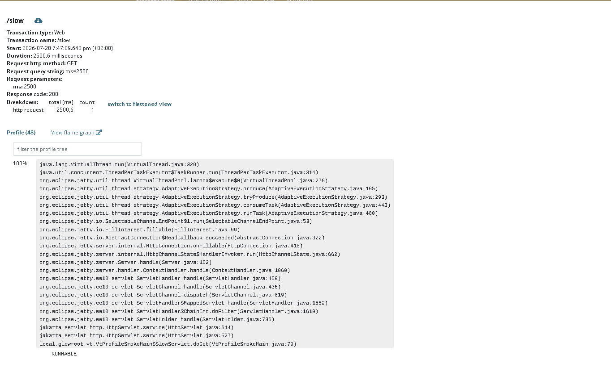

# Virtual-thread profile smoke (#1125)

Standalone Jetty 12 app that serves requests on **JDK 21+ virtual threads**, for verifying that Glowroot still captures **thread profiles** after the #1125 fix.

Not part of the main Maven reactor (build it only when you need this check).

## Prerequisites

- JDK **21+**
- Agent distribution already built:

```bash
mvn install -pl :glowroot-agent -am -DskipTests
```

## Run (Windows)

```bat
cd agent\vt-profile-smoke
setup-agent.bat
run.bat
```

Then:

```bat
curl http://127.0.0.1:8088/info
curl "http://127.0.0.1:8088/slow?ms=2500"
```

`/info` must print `virtual=true`.

## What to check

1. Open **http://127.0.0.1:4001** (port 4001 avoids clashing with another local Glowroot on 4000)
2. Transactions → Web → open a `/slow` trace
3. **Profile** should show samples, including `java.lang.VirtualThread.run` and `VtProfileSmokeMain$SlowServlet.doGet`

Example after the fix:



## Notes

- `setup-agent.bat` sets `slowThresholdMillis=0` and `profilingIntervalMillis=50` so every request is stored with dense samples.
- Thread CPU / blocked / waited stay N/A on virtual threads — expected; out of scope for #1125.
- Linux/macOS: unpack `agent/dist/target/glowroot-agent-*-dist.zip`, point `-javaagent` at `glowroot.jar`, run `mvn -DskipTests package` here, then `java -javaagent:... -jar target/vt-profile-smoke-1.0-SNAPSHOT.jar`.
